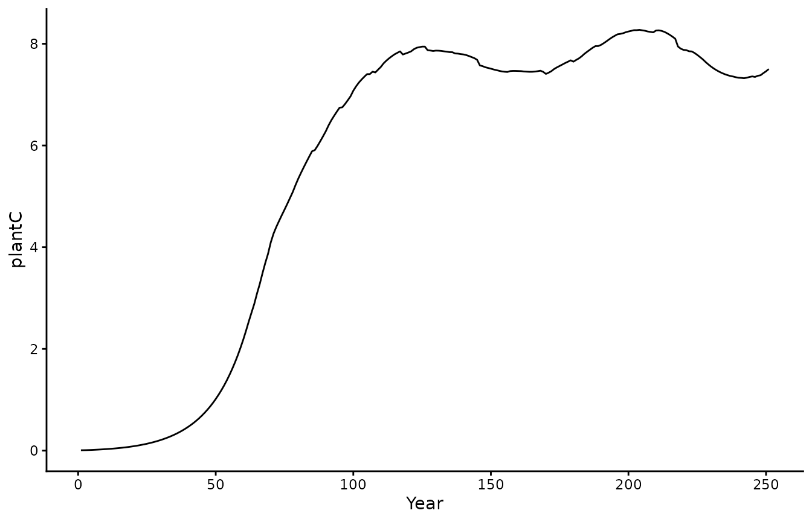
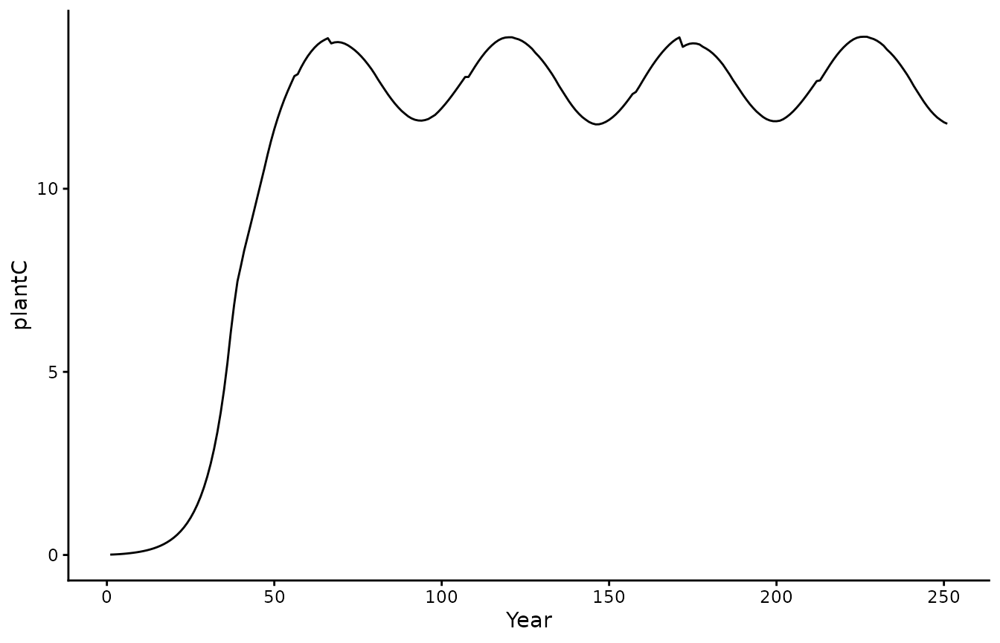
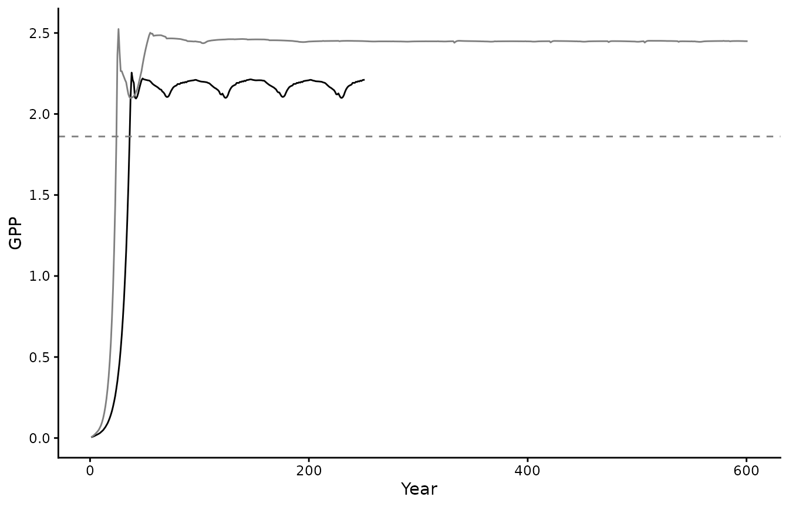
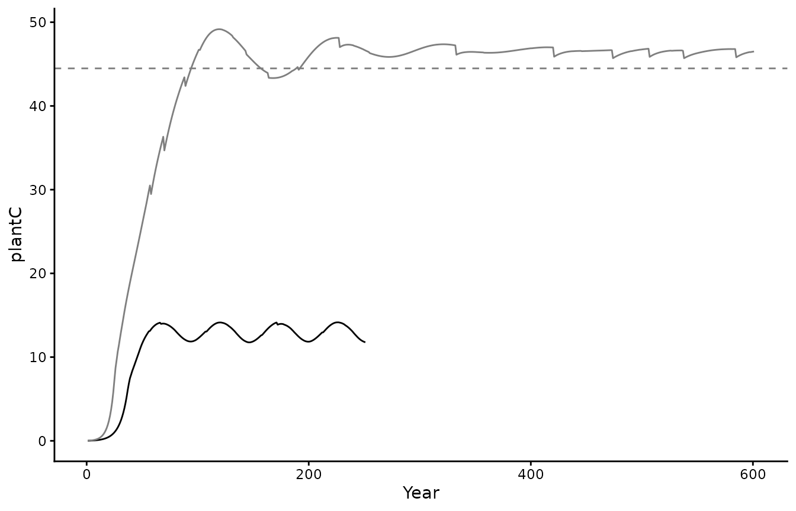
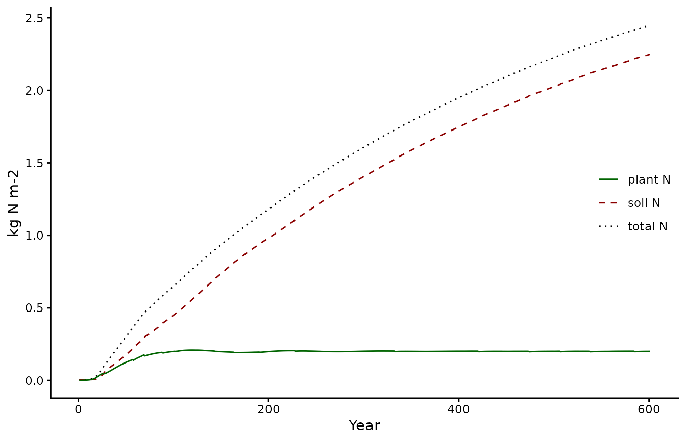

# BiomeE usage

The `rsofun` package and framework includes two distinct simulation
models. The `p-model` and `biomee` (which in part relies on p-model
component). Below we give a short example on how to run the `biomee`
model on the included demo datasets to familiarize yourself with both
the data structure and the outputs.

### Demo data

The package includes two demo datasets to run simulations at the site
CH-LAE with either the P-model or Leuning photosynthesis models. See
below under ‘Two model approaches’ for a brief description of the
differences. These demo files can be directly loaded into your workspace
by typing:

``` r
library(rsofun)

biomee_gs_leuning_drivers
biomee_p_model_drivers
biomee_validation
```

These are real data from the Swiss CH-LAE fluxnet site. We can use these
data to run the model, together with observations of GPP we can also
parameterize `biomee` parameters.

## Two model approaches

BiomeE is a cohort-based vegetation model which simulates vegetation
dynamics and biogeochemical processes (Weng et al., 2015). The model is
able to link photosynthesis standard models (Farquhar et al., 1980) with
tree allometry. In our formulation we retain the original model
structure with the standard photosynthesis formulation
(i.e. “gs_leuning”) as well as an alternative “p-model” approach. Both
model structures operate at different time scales, where the original
input has an hourly time step our alternative p-model approach uses a
daily time step. Hence, we have two different datasets as driver data
(with the BiomeE p-model input being an aggregate of the high resolution
hourly data).

### Running the BiomeE model with standard photosynthesis

With all data prepared we can run the model using
[`runread_biomee_f()`](https://geco-bern.github.io/rsofun/dev/reference/runread_biomee_f.md).
This function takes the nested data structure and runs the model site by
site, returning nested model output results matching the input drivers.
In our case only one site will be evaluated.

``` r
# print parameter settings
biomee_gs_leuning_drivers$params_siml
#> [[1]]
#> # A tibble: 1 × 10
#>   spinupyears recycle firstyeartrend nyeartrend steps_per_day
#>         <dbl>   <dbl>          <dbl>      <dbl>         <dbl>
#> 1         250       1           2009          1            24
#> # ℹ 5 more variables: do_U_shaped_mortality <lgl>, do_closedN_run <lgl>,
#> #   method_photosynth <chr>, method_mortality <chr>, do_daily_diagnostics <lgl>

# print forcing
head(biomee_gs_leuning_drivers$forcing)
#> [[1]]
#> # A tibble: 8,760 × 9
#>    date         hod   temp      rain   vpd        ppfd   patm  wind   co2
#>    <date>     <dbl>  <dbl>     <dbl> <dbl>       <dbl>  <dbl> <dbl> <dbl>
#>  1 2009-01-01     0 0.728  0.0000184  54.4 0.000000319 93216.  3.56  388.
#>  2 2009-01-01     1 0.780  0.0000116  54.9 0.000000322 93189.  3.37  388.
#>  3 2009-01-01     2 0.519  0.0000116  42.9 0.000000330 93184.  3.01  388.
#>  4 2009-01-01     3 0.476  0.0000116  47.3 0.000000311 93166.  3.31  388.
#>  5 2009-01-01     4 0.336  0.0000140  44.3 0.000000322 93143.  3.23  388.
#>  6 2009-01-01     5 0.278  0.0000140  38.4 0.000000329 93124.  2.94  388.
#>  7 2009-01-01     6 0.0966 0.0000140  28.5 0.000000329 93114.  2.98  388.
#>  8 2009-01-01     7 0.172  0.0000211  28.4 0.000000335 93111.  3.46  388.
#>  9 2009-01-01     8 0.236  0.0000211  30.1 0.0000179   93118.  3.31  388.
#> 10 2009-01-01     9 0.152  0.0000211  24.1 0.0000789   93132.  3.27  388.
#> # ℹ 8,750 more rows
```

``` r
set.seed(2023)

# run the model
out <- runread_biomee_f(
     biomee_gs_leuning_drivers,
     makecheck = TRUE,
     parallel = FALSE
     )
```

``` r
# split out the annual data
biomee_gs_leuning_output_annual_tile <- out$data[[1]]$output_annual_tile
biomee_gs_leuning_output_annual_cohorts <- out$data[[1]]$output_annual_cohorts
```

#### Plotting output

We can now visualize the model output.

``` r
# we only have one site so we'll unnest
# the main model output
biomee_gs_leuning_output_annual_tile |>
  ggplot() +
  geom_line(aes(x = year, y = GPP)) +
  theme_classic()+labs(x = "Year", y = "GPP")
```


``` r

biomee_gs_leuning_output_annual_tile |>
  ggplot() +
  geom_line(aes(x = year, y = plantC)) +
  theme_classic()+labs(x = "Year", y = "plantC")
```



### Running the BiomeEP model

Running BiomeE with P-model photosynthesis.

``` r
# print parameter settings
biomee_p_model_drivers$params_siml
#> [[1]]
#> # A tibble: 1 × 10
#>   spinupyears recycle firstyeartrend nyeartrend steps_per_day
#>         <dbl>   <dbl>          <dbl>      <dbl>         <dbl>
#> 1         250       1           2009          1             1
#> # ℹ 5 more variables: do_U_shaped_mortality <lgl>, do_closedN_run <lgl>,
#> #   method_photosynth <chr>, method_mortality <chr>, do_daily_diagnostics <lgl>

# print forcing for P-model
head(biomee_p_model_drivers$forcing)
#> [[1]]
#> # A tibble: 365 × 9
#>    date         hod    temp       rain   vpd      ppfd   patm  wind   co2
#>    <date>     <dbl>   <dbl>      <dbl> <dbl>     <dbl>  <dbl> <dbl> <dbl>
#>  1 2009-01-01  11.5  0.384  0.0000166   39.5 0.0000571 93092.  3.00  388.
#>  2 2009-01-02  11.5 -1.64   0.0000232   40.5 0.0000499 93248.  2.97  388.
#>  3 2009-01-03  11.5 -2.51   0.00000371  75.9 0.0000949 93684.  2.84  388.
#>  4 2009-01-04  11.5 -1.82   0.0000130   88.0 0.0000706 93435.  2.67  388.
#>  5 2009-01-05  11.5 -1.34   0.0000223   67.8 0.0000739 93175.  3.21  388.
#>  6 2009-01-06  11.5 -0.450  0.0000219   54.0 0.0000528 93282.  3.03  388.
#>  7 2009-01-07  11.5  0.266  0.0000136   64.1 0.0000711 93511.  2.64  388.
#>  8 2009-01-08  11.5  0.504  0.0000113   88.2 0.0000905 93443.  2.68  388.
#>  9 2009-01-09  11.5  0.0869 0.0000186   59.9 0.0000516 93447.  2.74  388.
#> 10 2009-01-10  11.5 -0.404  0.0000125   58.6 0.0000827 93633.  2.17  388.
#> # ℹ 355 more rows
```

``` r
# run the model
out2 <- runread_biomee_f(
     biomee_p_model_drivers,
     makecheck = TRUE,
     parallel = FALSE
     )
```

``` r
# split out the annual data for visuals
biomee_p_model_output_annual_tile <- out2$data[[1]]$output_annual_tile
biomee_p_model_output_annual_cohorts <- out2$data[[1]]$output_annual_cohorts
```

#### Plotting output

We can now visualize the model output.

``` r
# we only have one site so we'll unnest
# the main model output
biomee_p_model_output_annual_tile %>%
  ggplot() +
  geom_line(aes(x = year, y = GPP)) +
  theme_classic() +
  labs(x = "Year", y = "GPP")
```


``` r

biomee_p_model_output_annual_tile %>%
  ggplot() +
  geom_line(aes(x = year, y = plantC)) +
  theme_classic() +
  labs(x = "Year", y = "plantC")
```



``` r

biomee_p_model_output_annual_cohorts %>% 
  group_by(cID,year) %>%
  summarise(dbh = mean(DBH), 
            npp_per_m2=sum(NPP*density/10000), .groups = "keep") %>% 
  ggplot(aes(x=dbh,y=npp_per_m2,fill=as.factor(year))) +
  geom_bar(stat="identity") +
  theme_classic()+labs(x = "Cohort DBH (cm)", y = "NPP (kg C m-2)", fill="Year") +
  scale_fill_manual(values = c("grey50")) +
  theme(legend.position = c(1.0,1.0), legend.justification = c(1.0,1.0))
```


### Calibrating model parameters

To optimize new parameters based upon driver data and a validation
dataset we must first specify an optimization strategy and settings, as
well as parameter ranges. In this example, we use as cost the root mean
squared error (RMSE) between simulated and observed targets (GPP, LAI,
Density and Biomass) and we minimize it using the `GenSA` optimizer.

``` r
# Mortality as DBH
settings <- list(
  method = "GenSA",
  metric = cost_rmse_biomee,
  control = list(
    maxit = 10,
    verbose = TRUE
  ),
  par = list(
      phiRL     = list(lower=0.5, upper=5,   init=3.5),
      LAI_light = list(lower=2,   upper=8,   init=3.5),
      tf_base   = list(lower=0.5, upper=1.5, init=1),
      par_mort  = list(lower=0.005, upper=4,   init=0.5))
)

# Using BiomeEP (with P-model for photosynthesis)
pars_all <- calib_sofun(
  drivers = biomee_p_model_drivers,
  obs = biomee_validation,
  settings = settings
)
pars <- pars_all["par"]
```

Using the calibrated parameter values, we can run again the BiomeE
simulations.

``` r
# replace parameter values by calibration output
drivers <- biomee_p_model_drivers
drivers$params_species[[1]]$phiRL[]  <- pars$par[1]
drivers$params_species[[1]]$LAI_light[]  <- pars$par[2]
drivers$params_tile[[1]]$tf_base <- pars$par[3]
drivers$params_tile[[1]]$par_mort <- pars$par[4]

drivers$params_siml[[1]]$spinupyears <- 600

# run the model with new parameter values
calibrated_out <- runread_biomee_f(
     drivers,
     makecheck = TRUE,
     parallel = FALSE
     )

# split out the annual data
biomee_p_model_calibratedOutput_annual_tile <- calibrated_out$data[[1]]$output_annual_tile
```

Finally, we can visually compare the two model runs. We plot the
original model run in black and the run using the calibrated parameters
in grey. The dashed line represents the validation data, i.e. the
observed GPP and Biomass.

``` r
# unnest model output for our single site
GPP_target <- biomee_validation$data[[1]] |> 
  dplyr::filter(variables=="GPP") |> 
  magrittr::extract2("targets_obs")
plantC_target <- biomee_validation$data[[1]] |> 
  dplyr::filter(variables=="Biomass") |> 
  magrittr::extract2("targets_obs")

ggplot() +
  geom_line(data = biomee_p_model_output_annual_tile,
            aes(x = year, y = GPP)) +
  geom_line(data = biomee_p_model_calibratedOutput_annual_tile,
            aes(x = year, y = GPP),
            color = "grey50") +
  geom_hline(yintercept = GPP_target, 
             linetype = "dashed",
             color = "grey50") +
  theme_classic() + 
  labs(x = "Year", y = "GPP")
```



``` r

ggplot() +
  geom_line(data = biomee_p_model_output_annual_tile,
            aes(x = year, y = plantC)) +
  geom_line(data = biomee_p_model_calibratedOutput_annual_tile,
            aes(x = year, y = plantC),
            color = "grey50") +
  geom_hline(yintercept = plantC_target, 
             linetype = "dashed", 
             color = "grey50") +
  theme_classic() + 
  labs(x = "Year", y = "plantC")
```



### Validating model output

To ensure behavior of the calibrated model is as expected its output
should be validated with different consistency checks. One possible
check is to ensure that it reached the expected steady state conditions
and that no trend is present in total carbon. Note how the vegetation C
pool reaches a steady state relatively fast, while the soil C pool takes
more time:

``` r
pl1 <- biomee_p_model_calibratedOutput_annual_tile %>%
  ggplot(aes(x = year)) +
  geom_line(aes(y = plantC+soilC, color = "total C", linetype = "total C")) +
  geom_line(aes(y = soilC,        color = "soil C",  linetype = "soil C")) +
  geom_line(aes(y = plantC,       color = "plant C", linetype = "plant C")) +
  # geom_hline(yintercept = plantC_target, linetype = "solid", color = "grey50") +
  theme_classic() +
  scale_color_manual(values = c("total C"="black",
                                "soil C" ="darkred",
                                "plant C"="darkgreen")) +
  scale_linetype_manual(values = c("total C"=3,
                                   "soil C" =2,
                                   "plant C"=1)) +
  labs(x = "Year", y = "kg C m-2", linetype = NULL, color = NULL) + 
  theme(legend.position = c(1,0.5), legend.justification = c(1,0.5))

pl2 <- biomee_p_model_calibratedOutput_annual_tile %>%
  ggplot(aes(x = year)) +
  # geom_line(aes(y = NPP,          color = "plant: NPP", linetype = "plant: NPP")) +
  geom_line(aes(y = GPP,          color = "plant: GPP",           linetype = "plant: GPP")) +
  geom_line(aes(y = GPP-Rauto,    color = "plant: NPP=GPP-Rauto", linetype = "plant: NPP=GPP-Rauto")) +
  geom_line(aes(y = Rh,           color = "soil: Rh",             linetype = "soil: Rh")) +
  geom_line(aes(y = NPP-Rh,       color = "total: NEE=NPP-Rh",    linetype = "total: NEE=NPP-Rh")) +
  # geom_hline(yintercept = GPP_target, linetype = "solid", color = "grey50") +
  theme_classic() +
  scale_color_manual(values = c("total: NEE=NPP-Rh"   ="black",
                                "soil: Rh"           ="darkred",
                                "plant: GPP"          ="darkgreen",
                                "plant: NPP"          ="darkgreen",
                                "plant: NPP=GPP-Rauto"="darkgreen")) +
    scale_linetype_manual(values = c("total: NEE=NPP-Rh"   =3,
                                     "soil: Rh"           =2,
                                     "plant: GPP"          =1,
                                     "plant: NPP"          =2,
                                     "plant: NPP=GPP-Rauto"=2)) +
  labs(x = "Year", y = "kg C m-2 yr-1", linetype = NULL, color = NULL) + 
  theme(legend.position = c(1,0.5), legend.justification = c(1,0.5))
pl1
```


``` r
pl2
```


Note that for the carbon cycle the steady state assumption appears to be
good. However, for the nitrogen cycle we see that. If your analysis
relies on nitrogen being in steady-state the spinupyears might need to
be increased.

``` r
pl3 <- biomee_p_model_calibratedOutput_annual_tile %>%
  ggplot(aes(x = year)) +
  geom_line(aes(y = plantN+soilN, color = "total N", linetype = "total N")) +
  geom_line(aes(y = soilN,        color = "soil N",  linetype = "soil N")) +
  geom_line(aes(y = plantN,       color = "plant N", linetype = "plant N")) +
  theme_classic() +
  scale_color_manual(values = c("total N"="black",
                                "soil N" ="darkred",
                                "plant N"="darkgreen")) +
  scale_linetype_manual(values = c("total N"=3,
                                   "soil N" =2,
                                   "plant N"=1)) +
  labs(x = "Year", y = "kg N m-2", linetype = NULL, color = NULL) + 
  theme(legend.position = c(1,0.5), legend.justification = c(1,0.5))

pl3
```


